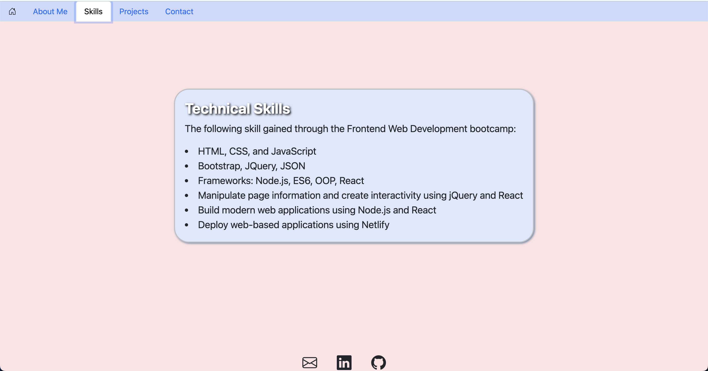
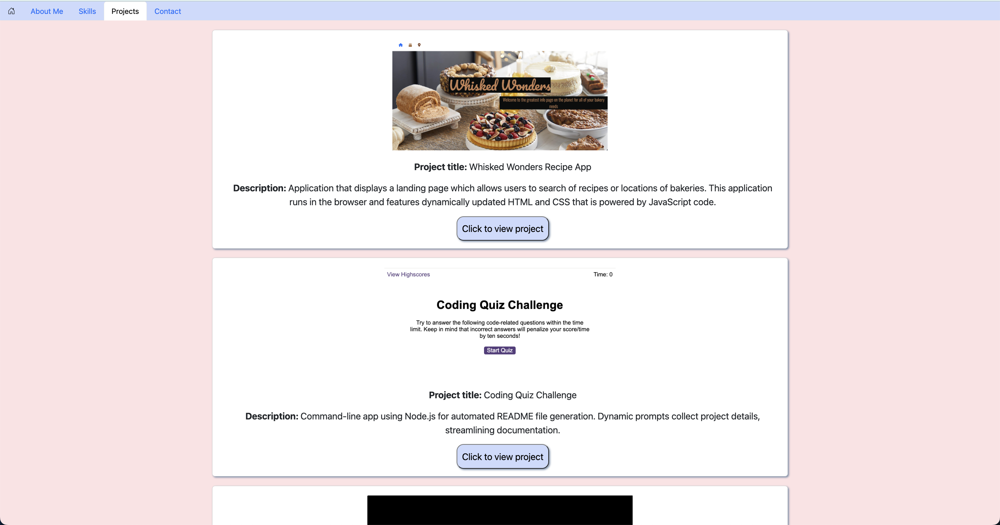
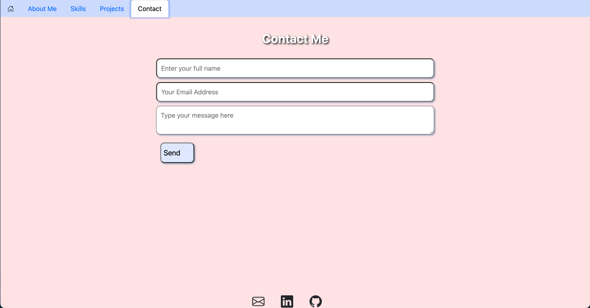

# React Portfolio

## Description

- Personal portfolio created using React to showcase projects I have worked on.

## License

## Contents

- [Description](#description)
- [License](#license)
- [Installation](#installation)
- [Usage](#usage)
- [Contributions](#contributions)
- [Tests](#tests)
- [Questions](#questions)

## Installation

- To install dependencies run command
  > npm i

## Usage

- Code is written so that when the user selects different navbar tabs, corresponding information is displayed such as About, Technical Skills, Projects and Contact page. Links to Linkedin, GitHub and Email takes user to relevant websites. Contact page that is set up using EmailJS service to allow users to contact me by entering in their full name, email address and a message.

## Contributions

- Pull requests are welcome. For major changes, please open an issue first to discuss what you would like to change.

## Tests

- To run tests, run command
  > npm test

## Questions

- If you have any questions about the repo, open an issue or contact me directly at katelee1129@gmail.com. You can find more of my work at [Chae-Lee](https://github.com/Chae-Lee).

# The final deployed application should look like this

<b> URL to the deployed Application </b>
https://chae-lee.github.io/team-profile-generator/

